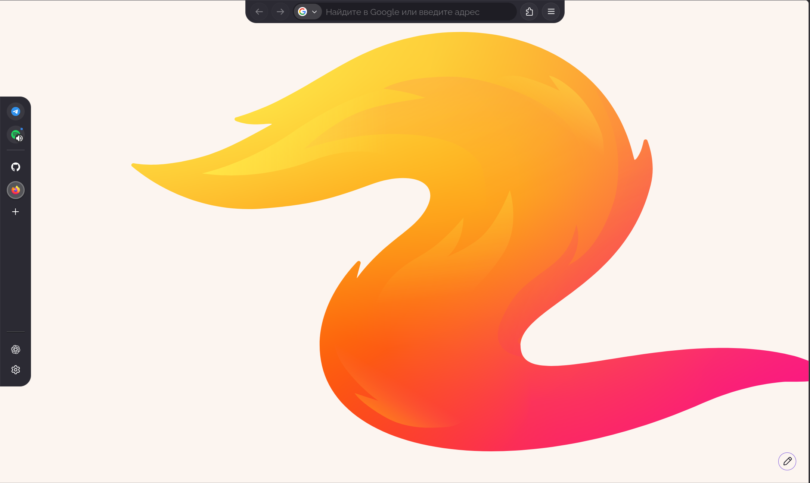

## Preview



## Firefox Floating Islands

Custom 'userChrome.css' theme for Firefox that transforms the browser interface

The theme is designed around compact rounded panels and floating navigation

## Features

- Floating navigation bar
- Rounded URL bar
- Compact circular toolbar buttons
- Minimal vertical tabs
- Icon-only vertical tabs
- Floating sidebar
- Rounded Firefox panels
- Hidden default toolbars
- Custom fullscreen behavior
- Modular CSS structure

## Structure

```text
firefox-floating-islands/
├── userChrome.css
├── .gitignore
└── css/
    ├── buttons.css
    ├── fullscreen.css
    ├── navbar.css
    ├── panels.css
    ├── sidebar.css
    ├── toolbox.css
    ├── urlbar.css
    └── vertical-tabs.css

The main userChrome.css imports all modules from the css/ directory.

Installation
1. Enable userChrome.css

Open Firefox and go to:

about:config

Set:

toolkit.legacyUserProfileCustomizations.stylesheets = true

to:

true
2. Find your Firefox profile

Open:

about:support

Find Profile Directory and open it.

Create a directory:

chrome
3. Install the theme

Copy:

userChrome.css
css/

into the chrome directory.

The resulting structure should be:

chrome/
├── userChrome.css
└── css/
    ├── buttons.css
    ├── fullscreen.css
    ├── navbar.css
    ├── panels.css
    ├── sidebar.css
    ├── toolbox.css
    ├── urlbar.css
    └── vertical-tabs.css
4. Restart Firefox

Restart Firefox after installing the files.

Compatibility

This theme targets modern Firefox with vertical tabs support.

Because Firefox's internal UI structure can change between versions, some selectors may require updates after major Firefox releases.

Development

The CSS is intentionally separated into modules so individual parts of the interface can be modified without editing one large stylesheet.

Changes can be tested by restarting Firefox after editing the CSS files.

License

MIT License.
